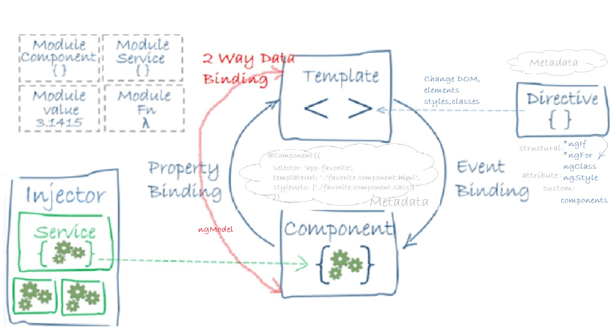

<!-- START doctoc generated TOC please keep comment here to allow auto update -->
<!-- DON'T EDIT THIS SECTION, INSTEAD RE-RUN doctoc TO UPDATE -->
**Table of Contents**  *generated with [DocToc](https://github.com/thlorenz/doctoc)*

- [I. Angular for busy devs](#i-angular-for-busy-devs)
  - [Angular App Architecture](#angular-app-architecture)
  - [Angular Development](#angular-development)
    - [Using Angular CLI for development](#using-angular-cli-for-development)
    - [Angular App Sructure](#angular-app-sructure)
    - [Webpack](#webpack)
    - [2. Typescript Fundamentals](#2-typescript-fundamentals)
    - [3. Building Blocks of Angular App](#3-building-blocks-of-angular-app)
    - [4. Displaying Data and Handling Events](#4-displaying-data-and-handling-events)
    - [5. Building Reusable Components](#5-building-reusable-components)
    - [6. Directives](#6-directives)
    - [7. Template driven forms](#7-template-driven-forms)
  - [8. Reactive forms](#8-reactive-forms)
  - [9. Consuming HTTP Services](#9-consuming-http-services)
  - [10. Routing and Navigation](#10-routing-and-navigation)
  - [11. Automated testing, TDD, Unit Testing](#11-automated-testing-tdd-unit-testing)
- [II. NgRx Implementation - REDUX Store in Angular](#ii-ngrx-implementation---redux-store-in-angular)
- [III. Small Redux Store](#iii-small-redux-store)
- [IV. Angular interview questions](#iv-angular-interview-questions)

<!-- END doctoc generated TOC please keep comment here to allow auto update -->


#  I. Angular for busy devs

## Angular App Architecture

To make you curious:



Go and study: [Building Blocks of Angular App](./src/app/README.md#3-building-blocks-of-angular-app)

## Angular Development

- Visual Studio Code
- cmder or a different terminal

Install node:

`npm i`

`npm node-sass`

Installed extensions:

  VS Live Share

  npm Intellisense

  Debugger For Chrome

  TS Lint

  Auto Import

  Sass

  Npm

MUST USE Shortcuts with VS Code:

    Shift + Ctrl + P - open commands pallet
    Ctrl + X - cut line
    Ctrl + Shift + K - delete line
    Ctrl + W - close current tab
    Alt + arrow left/right - switch to the next door tab
    Ctrl + ` - open console / terminal
    Ctrl + Shift + V - preview current file
    Ctrl + K Ctrl + O - open Directory
    q - quit/exit log screen from terminal
    Ctrl + P and type a distinctive file name fragment e.g. authors.html
    Ctrl + . when cursor is over the name of the class/interface you want to import
    Ctrl + K + W - close all tabs
    Ctrl + Tab keep Ctrl pressed and use Tab or up/down arrows to navigate between opened files
    Shift + Ctrl + O - go to method
    Shift + F12 - method  usages

### Using Angular CLI for development

```npm i -g @angular/cli``` - install Angular Command Line Interface
```npm i -g typescript``` - install typescript (ts server and tsc compiler)

 1. Start a new project

This project was generated with [Angular CLI](https://github.com/angular/angular-cli) version 7.0.6.

or run ```ng new myNewProject```

 2. Development server

Run `ng serve` for a dev server. Navigate to `http://localhost:4200/`. The app will automatically reload if you change any of the source files.

 3. Code scaffolding

Run `ng generate component component-name` to generate a new component. You can also use `ng generate directive|pipe|service|class|guard|interface|enum|module`.

 4. Build

Run `ng build` to build the project. The build artifacts will be stored in the `dist/` directory. Use the `--prod` flag for a production build.

 5. Running unit tests

Run `ng test` to execute the unit tests via [Karma](https://karma-runner.github.io) (karma is the tests runner and jasmine is the syntax).

 6. Running end-to-end tests

Run `ng e2e` to execute the end-to-end tests via [Protractor](http://www.protractortest.org/).

 6. Further help

To get more help on the Angular CLI use `ng help` or go check out the [Angular CLI README](https://github.com/angular/angular-cli/blob/master/README.md).

Sometimes rebuild of some components is required. For example, after installing node v11.5.
  had to run with admin rights: npm --add-python-to-path='true' --debug install --global windows-build-tools


 7. External references

[Start an Angular 7 app](https://medium.freecodecamp.org/whats-new-in-angular-7-0-and-how-to-upgrade-f2ed22a79e28)

[Angular Crush Course](https://www.udemy.com/angular-crash-course)

[Angular in depth](https://www.udemy.com/angular-from-beginner-to-advanced)

[RxJs Reactive Programming](https://github.com/angular-university/reactive-patterns-course)


###  Angular App Sructure

- e2e folder holds automated tests that simulate a real user.
- node_modules folder is purely for development (add to git ignore)

And this is where we store all the third party libraries that our application may depend upon. Now this folder is purely for development,

so when we compile our application, parts of this third party libraries are put in a bundle and deployed with our application.

Run ```npm i``` and this will install all the missing dependencies

- src folder - the actual source code of the app
  - app - at least one module and one component inside : AppModule, AppComponent

  - assets - images, style files

  - environment -  store configurations settings for different environments

  - main.ts - the starting point of the application -this is bootstraping the main module of the app: AppModule
  polyfills.ts, which basically imports some scripts that are required for running Angular. Because the Angular framework uses features

    of JavaScript that are not available in the current version of JavaScript supported by most browsers out there. So these polyfills

    fill the gap between the features of JavaScript that Angular needs and the features supported by the current browsers.

  - styles.css - the global styles of the app

  - test.ts - used for setting the test env

  - edit.config - make sure that all devs in the team use the same settings in their editors

  - karma.config.js is a test runner for JavaScript code

  - package.json - e standard file that every node project has:

    - some basic settings

    -  dependencies which determine the libraries your app is dependent on

    -  devDependencies - required for app development, not on production (includes karma dependencies for testing)

  - protractor.conf.js - a tool for running end-to-end tests for Angular

  - tsconfig.json - has a bunch of settings for TypeScript Compiler to compile .ts into .js code

  - tslint.json -  a static analize tool for .ts code (it checks for readability, maintainability, and functionality errors)


###  Webpack

Angular's CLI uses a tool called Webpack, which is a build automation tool. It gets all of our scripts and style sheets,combines them, puts them in a bundle, and then minifies that bundle, and this is for optimization.

Each time you change your code Webpack automatically recompiles your application and refreshes your bundles(Hot Module Replacement).

Webpack automatically injects all the scripts into our index.html, at runtime:
  tyles.bundle.js is a container for all the styles of the app compiled into one bundle

No need to do it with Angular CLI, but just to mention it: [Set-up Webpack and Babel for your web-server](https://gist.github.com/bitaemi/d429293325696eb11aaba058fd094f67)
  
### 2. Typescript Fundamentals

  - [2. Types](./src/app/README.md#232-types)
    - [ Type Assertions](./src/app/README.md#233-type-assertions)
    - [ Arrow Functions](./src/app/README.md#234-arrow-functions)
    - [ Interfaces](./src/app/README.md#235-interfaces)
    - [ Classes, Objects, Constructors](./src/app/README.md#236-classes-objects-constructors)
    - [ Access modifiers, Properties](./src/app/README.md#237-access-modifiers-properties)
    - [ Modules](./src/app/README.md#238-modules)

### 3. Building Blocks of Angular App

- [3.1. Component](./src/app/README.md#31-component)
  - [Create a component:](./src/app/README.md#create-a-component)
  - [Register it in a module:](./src/app/README.md#register-it-in-a-module)
  - [Add an element to the HTML markup](./src/app/README.md#add-an-element-to-the-html-markup)
  - [Generate Component Using Angular CLI](./src/app/README.md#generate-component-using-angular-cli)
- [3.2. Module](./src/app/README.md#32-module)
- [3.4. Directives](./src/app/README.md#34-directives)
- [3.5. Services](./src/app/README.md#35-services)
  - [3.5.1. Services and Dependency Injection](./src/app/README.md#351-services-and-dependency-injection)
- [Dependency Injection (DI)](./src/app/README.md#dependency-injection-di)
  - [3.5.2. Generating Services Using Angular CLI](./src/app/README.md#352-generating-services-using-angular-cli)
  - [Data Binding](./src/app/README.md#data-binding)
  - [Metadata](./src/app/README.md#metadata)
- [Angular App Architecture](./src/app/README.md#angular-app-architecture)

### 4. Displaying Data and Handling Events

- [4.1. Property Binding](./src/app/README.md#41-property-binding)
- [4.2. Attribute Binding](./src/app/README.md#42-attribute-binding)
- [4.3. Adding Bootstrap](./src/app/README.md#43-adding-bootstrap)
- [4.4. Class binding and Style Binding](./src/app/README.md#44-class-binding-and-style-binding)
- [4.5. Event Binding](./src/app/README.md#45-event-binding)
- [4.6. Event Filtering](./src/app/README.md#46-event-filtering)
- [4.7. Template variables](./src/app/README.md#47-template-variables)
- [4.8. Two way data-binding](./src/app/README.md#48-two-way-data-binding)
- [4.9. Pipes](./src/app/README.md#49-pipes)

### 5. Building Reusable Components

- [5.1. Component API, Input and Output Properties](./src/app/README.md#51-component-api-input-and-output-properties)
- [5.2. Templates and Styles](./src/app/README.md#52-templates-and-styles)
- [5.3. View Encapsulation](./src/app/README.md#53-view-encapsulation)
- [5.4. ngContent and ngContainer](./src/app/README.md#54-ngcontent-and-ngcontainer)

### 6. Directives

- [6.1. Built-In Directives](./src/app/README.md#61-built-in-directives)
  - [ngIf](./src/app/README.md#ngif)
  - [Hidden Property](./src/app/README.md#hidden-property)
  - [ngSwitch Case](./src/app/README.md#ngswitch-case)
  - [ngFor](./src/app/README.md#ngfor)
  - [ngFor and Change Detection](./src/app/README.md#ngfor-and-change-detection)
  - [ngFor and trackBy](./src/app/README.md#ngfor-and-trackby)
  - [The Leading Asterisk](./src/app/README.md#the-leading-asterisk)
  - [ngClass](./src/app/README.md#ngclass)
  - [ngStyle](./src/app/README.md#ngstyle)
  - [Safe Traversal Operator](./src/app/README.md#safe-traversal-operator)
  - [Creating Custom Directives](./src/app/README.md#creating-custom-directives)

### 7. Template driven forms

- [7.1. Building a Bootstrap Form](./src/app/README.md#71-building-a-bootstrap-form)
- [7.2. Types of forms](./src/app/README.md#72-types-of-forms)
- [7.3. Adding Validation](./src/app/README.md#73-adding-validation)
- [7.4. Specific validation errors](./src/app/README.md#74-specific-validation-errors)
- [7.8. Styling Invalid Input Fields](./src/app/README.md#78-styling-invalid-input-fields)
- [7.9. ngForm](./src/app/README.md#79-ngform)
- [7.10. NgModelGroup](./src/app/README.md#710-ngmodelgroup)
- [7.11. Control Classes and Directives](./src/app/README.md#711-control-classes-and-directives)
- [7.12. Disabling the Submit Button](./src/app/README.md#712-disabling-the-submit-button)
- [7.13. Working with Check Boxes](./src/app/README.md#713-working-with-check-boxes)
- [7.14. Working with Drop-Down Forms](./src/app/README.md#714-working-with-drop-down-forms)
- [7.15. Working with Radio Buttons](./src/app/README.md#715-working-with-radio-buttons)

## 8. Reactive forms

  - [8.1. Implementing Custom Validation](./src/app/README.md#81-implementing-custom-validation)
  - [8.2. Asynchronous Operations and Validation](./src/app/README.md#82-asynchronous-operations-and-validation)
  - [8.3. Validating the form upon submit](./src/app/README.md#83-validating-the-form-upon-submit)
  - [8.4. Nested FormGroups](./src/app/README.md#84-nested-formgroups)
  - [8.5. FormArray](./src/app/README.md#85-formarray)
  - [8.6. FormBuilder](./src/app/README.md#86-formbuilder)

## 9. Consuming HTTP Services

        POST - CREATE

        PATCH - UPDATE

        PUT - UPDATE

        DELETE - DELETE

        GET - READ

  - [9.1. Getting Data](./src/app/modules/consuming-http-services/README.md#91-getting-data)
  - [9.2. Creating Data](./src/app/modules/consuming-http-services/README.md#92-creating-data)
  - [9.3. Updating Data](./src/app/modules/consuming-http-services/README.md#93-updating-data)
  - [9.4. Deleting Data](./src/app/modules/consuming-http-services/README.md#94-deleting-data)
  - [9.5. OnInit Interface](./src/app/modules/consuming-http-services/README.md#95-oninit-interface)
  - [9.6. Separation of Concerns](./src/app/modules/consuming-http-services/README.md#96-separation-of-concerns)
  - [9.7. Extracting a Service](./src/app/modules/consuming-http-services/README.md#97-extracting-a-service)
  - [9.8. Handling Errors](./src/app/modules/consuming-http-services/README.md#98-handling-errors)
  - [9.9. Handling Unexpected Errors](./src/app/modules/consuming-http-services/README.md#99-handling-unexpected-errors)
  - [9.10. Throwing Application Specific Errors](./src/app/modules/consuming-http-services/README.md#910-throwing-application-specific-errors)
  - [9.11. Handling Bad Requests Errors](./src/app/modules/consuming-http-services/README.md#911-handling-bad-requests-errors)
  - [9.12. Importing Observable Operators and Factory Methods](./src/app/modules/consuming-http-services/README.md#912-importing-observable-operators-and-factory-methods)
  - [9.13. Global Error Handling](./src/app/modules/consuming-http-services/README.md#913-global-error-handling)
  - [9.14. Extracting a reusable Error Handling Method](./src/app/modules/consuming-http-services/README.md#914-extracting-a-reusable-error-handling-method)
  - [9.15. Extracting a reusable Data Service](./src/app/modules/consuming-http-services/README.md#915-extracting-a-reusable-data-service)
  - [9.16. The Map Operator](./src/app/modules/consuming-http-services/README.md#916-the-map-operator)
  - [9.17. Optimistic vs. Pesimistic Updates](./src/app/modules/consuming-http-services/README.md#917-optimistic-vs-pesimistic-updates)
  - [9.18. Observables vs. Promises](./src/app/modules/consuming-http-services/README.md#918-observables-vs-promises)

## 10. Routing and Navigation

  - [10. Routing and Navigation](./src/app/README.md#10-routing-and-navigation)
  - [10.1. Configure Routes](./src/app/README.md#101-configure-routes)
  - [10.2. RouterOutlet](./src/app/README.md#102-routeroutlet)
  - [10.3. RouterLink](./src/app/README.md#103-routerlink)
  - [10.3. RouterLinkActive](./src/app/README.md#103-routerlinkactive)
  - [10.4. Getting the Route Parameters](./src/app/README.md#104-getting-the-route-parameters)
  - [10.5. Routes with multiple parameters](./src/app/README.md#105-routes-with-multiple-parameters)
  - [10.6. Query Parameters](./src/app/README.md#106-query-parameters)
  - [10.8. SwitchMap Operator](./src/app/README.md#108-switchmap-operator)
  - [10.9. Programmatic navigation](./src/app/README.md#109-programmatic-navigation)

## 11. [Automated testing, TDD, Unit Testing](./src/README.md)

# II. NgRx Implementation - REDUX Store in Angular

Understanding the REDUX PATTERN is the key for understanding ngRx Library and using it to programm in a reactive style.

 - manage state using the ngRx STORE

 - redux with observables = manage the state usesing observables streams of data

 - immutable @Inputs (modify the copies of objects, and create new objects using the reference of the initial object)

 - performance benefits because object reference checks are fast (use ChangeDetectionStrategy.OnPush to compare object references, not objects)

 - support for: eagerly loaded modules & lazily loaded modules


 - [Elaborated REDUX Implementation](./src/app/store/README.md) 

- [Why use REACTIVE](./src/app/store/README.md#why-reactive) 
- [Implementation](./src/app/store/README.md#implementation)
  - [Step - add action constants and creators](./src/app/store/README.md#step---add-action-constants-and-creators)
  - [Step - create and register the reducer](./src/app/store/README.md#step---create-and-register-the-reducer)
  - [Step: composition with selectors](./src/app/store/README.md#step-composition-with-selectors)
  - [Side Effects Model for ngRx/store](./src/app/store/README.md#side-effects-model-for-ngrxstore)
  - [Optimize Data Structures with Entities](./src/app/store/README.md#optimize-data-structures-with-entities)
  - [Hooking up @ngRx-router-store](./src/app/store/README.md#hooking-up-ngrx-router-store)
  - [Extending the State Tree](./src/app/store/README.md#extending-the-state-tree)
  - [Entity Patterns, CRUD opperations](./src/app/store/README.md#entity-patterns-crud-opperations)
  - [Routing via Dispatch](./src/app/store/README.md#routing-via-dispatch)
  - [State Preload  and Protection via Guards](./src/app/store/README.md#state-preload--and-protection-via-guards)
  - [Observables and Change Detection](./src/app/store/README.md#observables-and-change-detection)
 
# III. [Small Redux Store](https://github.com/bitaemi/redux-store) 

# IV. [Angular interview questions](./src/app/README.md#angular-interview-questions)
