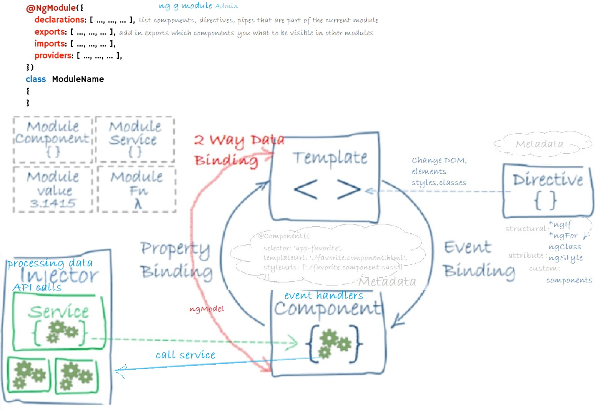

<!-- START doctoc generated TOC please keep comment here to allow auto update -->
<!-- DON'T EDIT THIS SECTION, INSTEAD RE-RUN doctoc TO UPDATE -->
**Table of Contents**  *generated with [DocToc](https://github.com/thlorenz/doctoc)*

- [I. Angular for busy devs](#i-angular-for-busy-devs)
  - [Angular App Architecture](#angular-app-architecture)
    - [Automate deployments using Gulp or Webpack](#automate-deployments-using-gulp-or-webpack)
    - [Webpack](#webpack)
    - [2. Typescript Fundamentals](#2-typescript-fundamentals)
    - [3. Building Blocks of Angular App](#3-building-blocks-of-angular-app)
    - [4. Displaying Data and Handling Events](#4-displaying-data-and-handling-events)
    - [5. Building Reusable Components](#5-building-reusable-components)
    - [6. Directives](#6-directives)
    - [7. Template driven forms](#7-template-driven-forms)
  - [8. Reactive forms](#8-reactive-forms)
  - [9. Consuming HTTP Services](#9-consuming-http-services)
  - [10. Routing and Navigation](#10-routing-and-navigation)
- [II) Automated testing, Unit Testing, Test Driven Design](#ii-automated-testing-unit-testing-test-driven-design)
  - [2. Test Driven Dev - Red, Green, Refactor](#2-test-driven-dev---red-green-refactor)
  - [3. Unit testing](#3-unit-testing)
    - [3.1 Angular Tests with Jest](#31-angular-tests-with-jest)
    - [11.3.2  Unit Testing RxJs with Marble Diagrams](#1132--unit-testing-rxjs-with-marble-diagrams)
- [III. NgRx Implementation - REDUX Store in Angular](#iii-ngrx-implementation---redux-store-in-angular)
- [IV. Small Redux Store](#iv-small-redux-store)
- [V. Angular interview questions](#v-angular-interview-questions)

<!-- END doctoc generated TOC please keep comment here to allow auto update -->

#  I. Angular for busy devs
Go and study:

- [Angular development](./src/app/README.md#angular-development)

- [Building Blocks of Angular App](./src/app/README.md#3-building-blocks-of-angular-app)

## Angular App Architecture

To make you curious:




### Automate deployments using Gulp or Webpack

``npm i gulp --save-dev``
One way to automate the build of distributables=web dev artifacts and the copying process on the server is to use Gulp.
Look into gulpfile.js
```JavaScript
gulp.task("Copy-dist-to-wwwroot", () => {
    return gulp.src("./dist/TaskManager/**/*")
        .pipe(gulp.dest("C:\\Angular\\MvcTaskManager\\MvcTaskManager\\wwwroot"));
});

// by default, whach the dist folder, any time the any of the files from dist folder changes, then copy the files on the server to render
gulp.task("default", () => {
    gulp.watch("./dist/TaskManager", gulp.series("Copy-dist-to-wwwroot"));
});
```
```bash
ng build --watch #starts Angular app and watches for changes
# open new terminal window and start gulp:
gulp #each ttime code is changed it recompiles the app and copies dist files into wwwroot
```
or [detailed Gulp task runner configuration done witht RxJs](https://github.com/bitaemi/rxjs-reactive-patterns/tree/master/RxJs-no-framework#gulp-task-runner-configuration)
###  Webpack

Angular's CLI uses a tool called Webpack, which is a build automation tool. It gets all of our scripts and style sheets,combines them, puts them in a bundle, and then minifies that bundle, and this is for optimization.

Each time you change your code Webpack automatically recompiles your application and refreshes your bundles(Hot Module Replacement).

Webpack automatically injects all the scripts into our index.html, at runtime:
  tyles.bundle.js is a container for all the styles of the app compiled into one bundle

No need to do it with Angular CLI, but just to mention it (a full webpack config and doc is here):
[https://github.com/bitaemi/React-app-Hooks-Context-reducers/tree/master/webpack-configs-apps](https://github.com/bitaemi/React-app-Hooks-Context-reducers/tree/master/webpack-configs-apps)

### 2. Typescript Fundamentals

  - [2. Types](./src/app/README.md#232-types)
    - [ Type Assertions](./src/app/README.md#233-type-assertions)
    - [ Arrow Functions](./src/app/README.md#234-arrow-functions)
    - [ Interfaces](./src/app/README.md#235-interfaces)
    - [ Classes, Objects, Constructors](./src/app/README.md#236-classes-objects-constructors)
    - [ Access modifiers, Properties](./src/app/README.md#237-access-modifiers-properties)
    - [ Modules](./src/app/README.md#238-modules)

### 3. Building Blocks of Angular App

- [3.1. Component](./src/app/README.md#31-component)
  - [Create a component:](./src/app/README.md#create-a-component)
  - [Register it in a module:](./src/app/README.md#register-it-in-a-module)
  - [Add an element to the HTML markup](./src/app/README.md#add-an-element-to-the-html-markup)
  - [Generate Component Using Angular CLI](./src/app/README.md#generate-component-using-angular-cli)
- [3.2. Module](./src/app/README.md#32-module)
- [3.4. Directives](./src/app/README.md#34-directives)
- [3.5. Services](./src/app/README.md#35-services)
  - [3.5.1. Services and Dependency Injection](./src/app/README.md#351-services-and-dependency-injection)
- [Dependency Injection (DI)](./src/app/README.md#dependency-injection-di)
  - [3.5.2. Generating Services Using Angular CLI](./src/app/README.md#352-generating-services-using-angular-cli)
  - [Data Binding](./src/app/README.md#data-binding)
  - [Metadata](./src/app/README.md#metadata)
- [Angular App Architecture](./src/app/README.md#angular-app-architecture)

### 4. Displaying Data and Handling Events

- [4.1. Property Binding](./src/app/README.md#41-property-binding)
- [4.2. Attribute Binding](./src/app/README.md#42-attribute-binding)
- [4.3. Adding Bootstrap](./src/app/README.md#43-adding-bootstrap)
- [4.4. Class binding and Style Binding](./src/app/README.md#44-class-binding-and-style-binding)
- [4.5. Event Binding](./src/app/README.md#45-event-binding)
- [4.6. Event Filtering](./src/app/README.md#46-event-filtering)
- [4.7. Template variables](./src/app/README.md#47-template-variables)
- [4.8. Two way data-binding](./src/app/README.md#48-two-way-data-binding)
- [4.9. Pipes](./src/app/README.md#49-pipes)

### 5. Building Reusable Components

- [5.1. Component API, Input and Output Properties](./src/app/README.md#51-component-api-input-and-output-properties)
- [5.2. Templates and Styles](./src/app/README.md#52-templates-and-styles)
- [5.3. View Encapsulation](./src/app/README.md#53-view-encapsulation)
- [5.4. ngContent and ngContainer](./src/app/README.md#54-ngcontent-and-ngcontainer)

### 6. Directives

- [6.1. Built-In Directives](./src/app/README.md#61-built-in-directives)
  - [ngIf](./src/app/README.md#ngif)
  - [Hidden Property](./src/app/README.md#hidden-property)
  - [ngSwitch Case](./src/app/README.md#ngswitch-case)
  - [ngFor](./src/app/README.md#ngfor)
  - [ngFor and Change Detection](./src/app/README.md#ngfor-and-change-detection)
  - [ngFor and trackBy](./src/app/README.md#ngfor-and-trackby)
  - [The Leading Asterisk](./src/app/README.md#the-leading-asterisk)
  - [ngClass](./src/app/README.md#ngclass)
  - [ngStyle](./src/app/README.md#ngstyle)
  - [Safe Traversal Operator](./src/app/README.md#safe-traversal-operator)
  - [Creating Custom Directives](./src/app/README.md#creating-custom-directives)

### 7. Template driven forms

- [7.1. Building a Bootstrap Form](./src/app/README.md#71-building-a-bootstrap-form)
- [7.2. Types of forms](./src/app/README.md#72-types-of-forms)
- [7.3. Adding Validation](./src/app/README.md#73-adding-validation)
- [7.4. Specific validation errors](./src/app/README.md#74-specific-validation-errors)
- [7.8. Styling Invalid Input Fields](./src/app/README.md#78-styling-invalid-input-fields)
- [7.9. ngForm](./src/app/README.md#79-ngform)
- [7.10. NgModelGroup](./src/app/README.md#710-ngmodelgroup)
- [7.11. Control Classes and Directives](./src/app/README.md#711-control-classes-and-directives)
- [7.12. Disabling the Submit Button](./src/app/README.md#712-disabling-the-submit-button)
- [7.13. Working with Check Boxes](./src/app/README.md#713-working-with-check-boxes)
- [7.14. Working with Drop-Down Forms](./src/app/README.md#714-working-with-drop-down-forms)
- [7.15. Working with Radio Buttons](./src/app/README.md#715-working-with-radio-buttons)

## 8. Reactive forms

  - [8.1. Implementing Custom Validation](./src/app/README.md#81-implementing-custom-validation)
  - [8.2. Asynchronous Operations and Validation](./src/app/README.md#82-asynchronous-operations-and-validation)
  - [8.3. Validating the form upon submit](./src/app/README.md#83-validating-the-form-upon-submit)
  - [8.4. Nested FormGroups](./src/app/README.md#84-nested-formgroups)
  - [8.5. FormArray](./src/app/README.md#85-formarray)
  - [8.6. FormBuilder](./src/app/README.md#86-formbuilder)

## 9. Consuming HTTP Services

        POST - CREATE

        PATCH - UPDATE

        PUT - UPDATE

        DELETE - DELETE

        GET - READ

  - [9.1. Getting Data](./src/app/components/consuming-http-services/README.md#91-getting-data)
  - [9.2. Creating Data](./src/app/components/consuming-http-services/README.md#92-creating-data)
  - [9.3. Updating Data](./src/app/components/consuming-http-services/README.md#93-updating-data)
  - [9.4. Deleting Data](./src/app/components/consuming-http-services/README.md#94-deleting-data)
  - [9.5. OnInit Interface](./src/app/components/consuming-http-services/README.md#95-oninit-interface)
  - [9.6. Separation of Concerns](./src/app/components/consuming-http-services/README.md#96-separation-of-concerns)
  - [9.7. Extracting a Service](./src/app/components/consuming-http-services/README.md#97-extracting-a-service)
  - [9.8. Handling Errors](./src/app/components/consuming-http-services/README.md#98-handling-errors)
  - [9.9. Handling Unexpected Errors](./src/app/components/consuming-http-services/README.md#99-handling-unexpected-errors)
  - [9.10. Throwing Application Specific Errors](./src/app/components/consuming-http-services/README.md#910-throwing-application-specific-errors)
  - [9.11. Handling Bad Requests Errors](./src/app/components/consuming-http-services/README.md#911-handling-bad-requests-errors)
  - [9.12. Importing Observable Operators and Factory Methods](./src/app/components/consuming-http-services/README.md#912-importing-observable-operators-and-factory-methods)
  - [9.13. Global Error Handling](./src/app/components/consuming-http-services/README.md#913-global-error-handling)
  - [9.14. Extracting a reusable Error Handling Method](./src/app/components/consuming-http-services/README.md#914-extracting-a-reusable-error-handling-method)
  - [9.15. Extracting a reusable Data Service](./src/app/components/consuming-http-services/README.md#915-extracting-a-reusable-data-service)
  - [9.16. The Map Operator](./src/app/components/consuming-http-services/README.md#916-the-map-operator)
  - [9.17. Optimistic vs. Pesimistic Updates](./src/app/components/consuming-http-services/README.md#917-optimistic-vs-pesimistic-updates)
  - [9.18. Observables vs. Promises](./src/app/components/consuming-http-services/README.md#918-observables-vs-promises)

## 10. Routing and Navigation

  - [10. Routing and Navigation](./src/app/README.md#10-routing-and-navigation)
  - [10.1. Configure Routes](./src/app/README.md#101-configure-routes)
  - [10.2. RouterOutlet](./src/app/README.md#102-routeroutlet)
  - [10.3. RouterLink](./src/app/README.md#103-routerlink)
  - [10.3. RouterLinkActive](./src/app/README.md#103-routerlinkactive)
  - [10.4. Getting the Route Parameters](./src/app/README.md#104-getting-the-route-parameters)
  - [10.5. Routes with multiple parameters](./src/app/README.md#105-routes-with-multiple-parameters)
  - [10.6. Query Parameters](./src/app/README.md#106-query-parameters)
  - [10.8. SwitchMap Operator](./src/app/README.md#108-switchmap-operator)
  - [10.9. Programmatic navigation](./src/app/README.md#109-programmatic-navigation)

# II) Automated testing, Unit Testing, Test Driven Design
  [1. Automated tests](./src/README.md#1-automated-tests)
## 2. Test Driven Dev - Red, Green, Refactor
  [2.1 When to Introduce TDD :](./src/README.md#21-when-to-introduce-tdd-)
  [2.2 When NOT to Introduce TDD :](./src/README.md#22-when-not-to-introduce-tdd-)
  [2.3 Mesure Success with TDD](./src/README.md#23-mesure-success-with-tdd)
## 3. Unit and Integration Testing

- [3.0. Unit Testing Examples](./src/README.md#30-unit-testing-examples)
  - [Setup methods for testing](./src/app/modules/learn-unit-testing/README.md#setup-methods-for-testing)
  - [Test component that has injected a FormBuilder](./src/app/modules/learn-unit-testing/README.md#test-component-that-has-injected-a-formbuilder)
  - [Test a component with event emitter](./src/app/modules/learn-unit-testing/README.md#test-a-component-with-event-emitter)
  - [Test a component that has an injected service](./src/app/modules/learn-unit-testing/README.md#test-a-component-that-has-an-injected-service)

- [3.1. Integration Tests](./src/README.md#31-integration-tests)
  
  ### 3.1 Angular Tests with Jest

  [3.1.2. Jest is better](./src/README.md#312-jest-is-better)

  [3.1.3. Installation steps:](./src/README.md#313-installation-steps)

  [3.1.5 SnapShot testing](./src/README.md#315-snapshot-testing)

  ### 11.3.2  Unit Testing RxJs with Marble Diagrams

  [3.2  Unit Testing RxJs with Marble Diagrams](./src/README.md#32--unit-testing-rxjs-with-marble-diagrams)

  [3.2.2 Marble Syntax - RxJs Empty and Never Observables](./src/README.md#322-marble-syntax---rxjs-empty-and-never-observables)

  [3.2.3 Write the first marble test](./src/README.md#323-write-the-first-marble-test)

  [3.2 Model Observables using hot() or cold() methods in unit testing](./src/README.md#32-model-observables-using-hot-or-cold-methods-in-unit-testing)

  [3.3. Unit testing by mocking Observable values](./src/README.md#33-unit-testing-by-mocking-observable-values)

  [3.4. Testing RxJS Operators](./src/README.md#34-testing-rxjs-operators)

  [3.5. Testing Business Code](./src/README.md#35-testing-business-code)

  [3.6. Handling Errors and Race Conditions](./src/README.md#36-handling-errors-and-race-conditions)

# III. NgRx Implementation - REDUX Store in Angular

Understanding the REDUX PATTERN is the key for understanding ngRx Library and using it to programm in a reactive style.

 - manage state using the ngRx STORE

 - redux with observables = manage the state useing observables streams of data

 - immutable @Inputs (modify the copies of objects, and create new objects using the reference of the initial object)

 - performance benefits because object reference checks are fast (use ChangeDetectionStrategy.OnPush to compare object references, not objects)

 - support for: eagerly loaded modules & lazily loaded modules


 - [Elaborated REDUX Implementation](./src/app/store/README.md) 

- [Why use REACTIVE](./src/app/store/README.md#why-reactive) 
- [Implementation](./src/app/store/README.md#implementation)
  - [Step - add action constants and creators](./src/app/store/README.md#step---add-action-constants-and-creators)
  - [Step - create and register the reducer](./src/app/store/README.md#step---create-and-register-the-reducer)
  - [Step: composition with selectors](./src/app/store/README.md#step-composition-with-selectors)
  - [Side Effects Model for ngRx/store](./src/app/store/README.md#side-effects-model-for-ngrxstore)
  - [Optimize Data Structures with Entities](./src/app/store/README.md#optimize-data-structures-with-entities)
  - [Hooking up @ngRx-router-store](./src/app/store/README.md#hooking-up-ngrx-router-store)
  - [Extending the State Tree](./src/app/store/README.md#extending-the-state-tree)
  - [Entity Patterns, CRUD opperations](./src/app/store/README.md#entity-patterns-crud-opperations)
  - [Routing via Dispatch](./src/app/store/README.md#routing-via-dispatch)
  - [State Preload  and Protection via Guards](./src/app/store/README.md#state-preload--and-protection-via-guards)
  - [Observables and Change Detection](./src/app/store/README.md#observables-and-change-detection)
 
# IV. [Small Redux Store](https://github.com/bitaemi/redux-store) 

# V. [Angular interview questions](./src/app/angular-readme/README.md#angular-interview-questions)
