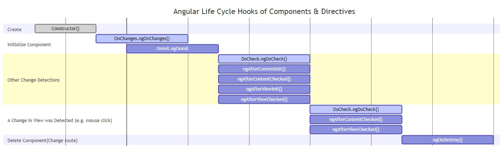
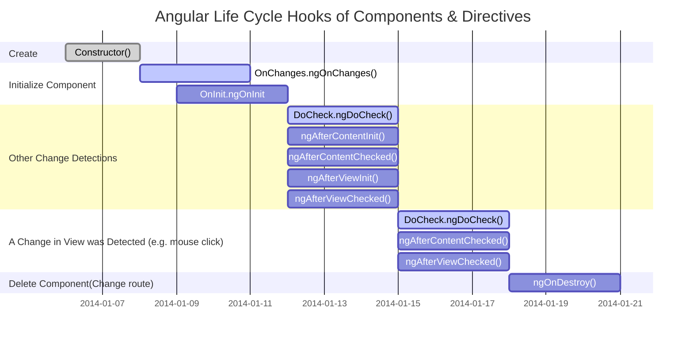

<!-- START doctoc generated TOC please keep comment here to allow auto update -->
<!-- DON'T EDIT THIS SECTION, INSTEAD RE-RUN doctoc TO UPDATE -->
**Table of Contents**  *generated with [DocToc](https://github.com/thlorenz/doctoc)*

- [Angular lifecycle hooks](#angular-lifecycle-hooks)
- [Passing  data from parent to child component via `@Input` decorator and input property:](#passing--data-from-parent-to-child-component-via-input-decorator-and-input-property)
- [Passing data from child to parent via `@Output` decorator and `EventEmitter`;](#passing-data-from-child-to-parent-via-output-decorator-and-eventemitter)
- [Passing input to sibling(frate) components :](#passing-input-to-siblingfrate-components-)
- [Passing data between non related components - use BehavioralSubject](#passing-data-between-non-related-components---use-behavioralsubject)
- [Using ReplaySubject:](#using-replaysubject)
- [Pass data between component using Angular Route:](#pass-data-between-component-using-angular-route)
- [Subject vs behavior subject](#subject-vs-behavior-subject)
- [`@VewChild`](#vewchild)
- [Http Header Interceptor](#http-header-interceptor)
- [Git stash](#git-stash)
- [Store critical data - observables, ngrx](#store-critical-data---observables-ngrx)
- [RXJS observables](#rxjs-observables)
- [Unit testing framework](#unit-testing-framework)
- [Routing](#routing)
- [Services](#services)
- [Template](#template)
- [Explain the difference between Angular expressions and JavaScript expressions?](#explain-the-difference-between-angular-expressions-and-javascript-expressions)

<!-- END doctoc generated TOC please keep comment here to allow auto update -->
# Angular lifecycle hooks 
- with these methods we can respond and act at a specific moment in the life of a component




- `ngOnChanges` - once - respond when Angular sets (one time, after componet construction) or resets(after each ngDoCheck) data-bound input properties; receives a SimpleChanges object of current and previous property values

- `ngOnInit` - once - initialize the directive or component, after Angular displays for the first time the data-bound props or input props - good to gather here the data coming from API calls

- `ngDoCheck` - executes when an event occures, before change "detection process" occures.Used to identify wheather change detection process occures or not. Thus, helps to detect or act upon changes that Angular cannot detect on it's own (if you we use 3rd parties controls that Angular cannot recognize - e.g you have JavaScript code that executes outside like a click event))

- `ngAfterContentInit` - exe one time in the life of a component, after suppling the component along with parent component (use it to get the content properties of children components), 

- `ngAfterContentChecked` - executes each time, after "change detection" process of the component data,

- `ngAfterViewInit` - once, after initializing all elements in the template of the component - use it if we need to manipulate properties of the view children(inner templates),

- `ngAfterViewChecked` -  executes each time, after "change detection" process of "View" of the component,
- `ngOnDestroy` - use it to cleanup: unsubscribe to observables or detach event handlers, just before Angular destroys the component

A Mermaid diagram can be seen below using Mermaid Preview Extention in VSCode (+ Markdown Preview Enhanced) (waiting for GitHub support to preview in browser)



  For testing use this file: [https://github.com/bitaemi/Angular-ngRx-Jest-Marble/blob/reactive-forms-auth-interceptors-advance/src/app/admin/components/project/project.component.ts](https://github.com/bitaemi/Angular-ngRx-Jest-Marble/blob/reactive-forms-auth-interceptors-advance/src/app/admin/components/project/project.component.ts)

# Passing  data from parent to child component via `@Input` decorator and input property:
In the child component js we pass the input properties using the `@Input` decorator

```TypeScript
// in child componet:

  @Input() hero: Hero;
  @Input('master') masterName: string; // this aliases the master property to masterName as an input
  // in parent component, in the HTML temlate:

  <app-hero-child *ngFor="let hero of heroes"
      [hero]="hero"
      [master]="master">
    </app-hero-child>
```
# Passing data from child to parent via `@Output` decorator and `EventEmitter`;

```TypeScript
// in child component we declare:

@Output() childToParent = new EventEmitter<String>();
// we need to buble this event with value, to parent components
sendToParent(name){
  this.childToParent.emit(name);
}
```
In the parent component we have to associate childToParent to the property to the child tag.

```TypeScript
<app-child [childToMaster]=product.productName 
(childToParent)=”childToParent($event)”></app-child>
```
Once the value is receved in the parent component, we have to set it:
```TypeScript
childToParent(name){
this.product.productName=name;
}
```
# Passing input to sibling(frate) components :

- a way is to combine data sharings between parent and child, so that subling components talk with the parent and get data from it;
- a second way: share data using `@ViewChild` decorator - allows child component to be injected in parent components. It allows parents to control child's methods and properties, But a parent can get access to the properties after view init event. That means we have to implement ngAfterViewInit life cycle hook in order to get the properties from parent components.
```TypeScript
@ViewChild(AppChildComponent) child;
constructor() { } 
ngAfterViewInit() { 
  this.product.productName=child.masterName; //<= This will set data
}
```
-  another way is to use the hierarchical dependency injection. We create a shared service and we declare it as a provider at the level of the parent that has as children all the components in need for that service

```TypeScript
    providers: [SharedService],
    directives: [ChildComponent, ChildSiblingComponent]
```
and we inject the service in each child component ( as a param in the constructor) and use the service inside the ngOnInit to get the data.

 # Passing data between non related components - use BehavioralSubject
When there is no relation between the components(components are in different modules) or in  scenarios like: you have a list of products and click on a particular product and then redirect to product details components. In these kinds of scenarios, we have to use data service to share data between components.
For creating data service. We have to define `BehaviorSubject`. `BehaviorSubject` holds the current value and the last value.
```TypeScript
import { Injectable } from '@angular/core';
import { Subject, BehaviorSubject, Observable } from 'rxjs';
import {Product} from './product';

@Injectable()
export class SharedDataService {
      constructor(){}
   //Using any
    public editDataDetails: any = [];
    public productData:Product={} as Product;
    private messageSource = new BehaviorSubject(this.editDataDetails);
    currentMessage = this.messageSource.asObservable();

    changeMessage(message: string) {
        this.messageSource.next(message)
    }

    //Using Interfaces
      private productRecord: BehaviorSubject<Product> = new BehaviorSubject<Product>(this.productData);
 
    public getProductRecord(): Observable<Product> {
      return this.productRecord.asObservable();
    }
 
    public setProductRecord(product: Product): void {
      this.productRecord.next(this.productData);
    }
    
}
```
I always prefer to use BehaviorSubject because of following reasons:
- It automatically updates the lates value wherever subscribed.
- Always give last value when called via `getValue()` method.
No need to call next, just create a set and get method in order to get value.
In the data service, I have created messageSource as BehaviorSubject. This accepts editDataDetails as any. We can create editDataDetails as the type of Product interface which is a much better practice. Create changeMessage method which will set the current value of observables.
```TypeScript
export class SharedDataService {
  constructor(){}
  //Using any
  public editDataDetails: any = [];
  public subject = new Subject<any>();
  private messageSource = new  BehaviorSubject(this.editDataDetails);
  currentMessage = this.messageSource.asObservable();
  changeMessage(message: string) {
    this.messageSource.next(message)
  }
}
```
Now we have to share this service for the component where we want to get set the values. Call changeMessage method with value as parameter to set the value. In component where we want to receive the value subscribe it. Once you subscribe you will always get the latest value without any code changes.

```TypeScript
//Set value in component 1
this.sharedDataService.changeMessage("message here");
//Get value in component 2
selectedMessage:any;
ngOnInit() {
 this.sharedDataService.currentMessage.subscribe(message => (this.selectedMessage= message)); //<= Always get current value!
}
```
Bonus 1: Creating Get and Set Property and BehaviourSubject:
In the above example, we can optimize more using Product interface and create a getter and setter method by following method.
```TypeScript
import { Injectable } from '@angular/core';
import { Subject, BehaviorSubject, Observable,ReplaySubject } from 'rxjs';
import {Product} from './product';
@Injectable()
export class SharedDataService {
constructor(){}
//Using Interfaces
public productData:Product={} as Product;
private productRecord: BehaviorSubject<Product> = new BehaviorSubject<Product>(this.productData);
public getProductRecord(): Observable<Product> {
return this.productRecord.asObservable();
}
public setProductRecord(product: Product): void {
this.productRecord.next(this.productData);
}
}
```
Now set from the component from where you want to set data. And subscribe the get method to get the latest value of product data.
```TypeScript
//Set value in component 1
var product:Product = {productID:234, productName:"Amazon"}
this.sharedDataService.setProductRecord(product);
//Get value in component 2
selectedProduct: Product;
ngOnInit() {
 this.sharedDataService.getProductRecord().subscribe(p=> (this.selectedProduct= p)); //<= Always get current value!
}
```
# Using ReplaySubject:
 ReplaySubject has a buffer that holds more than one value.
In many scenarios, <b><i>we need subjects to remember old values</i></b>. i.e. in rating product we want to give data to analytic engine in order to check what user selected last three times. In order to achieve this we can create `ReplaySubjects` like this:
```TypeScript
private productRecord: ReplaySubject<Product> = new ReplaySubject<Product>();
```
# Pass data between component using Angular Route:
If you are using router navigation to navigate to other components. You can pass it in the router navigate method.
```TypeScript
//Component 1:
constructor(private router: Router,private renderer: Renderer) {}
this.router.navigate([‘product/productdetail’, { ‘productID’: 21}]);
```
In the above code, we are setting product Id in query param when the component is routing to product details. Now in the product details component grab that id in the constructor.
```TypeScript
//Component 2:
constructor(private route: ActivatedRoute,private router: Router) {
  route.params.subscribe(params => {
    let data = params[‘productID’]
    console.log(`Log the param data ${data}`);
  });
}
```
Here in the second component, you will get productID. Since this data always passes through URL, so it is visible to end users. So avoid passing sensitive information (to prevent any vulnerability). However, you can always leverage this for fewer fields and regular data.

- another way is to use `ngRx` library and to have a centralized store where to store the state of components in a centralized place; The data flow is one way stream of data: from components to the store;

# Subject vs behavior subject

The difference between Subject and BehavioralSubject is that the BehavioralSubject holds one value, Subject doesn't.
BehaviorSubject keeps in memory the last value that was emitted by the Observable. A regular Subject doesn't. If we create a Subject using the RxJs. 

```TypeScript
const subject = new Rx.Subject();
subject.next(1); // even though we push the value 1 on the subject, this is not holded by the subject
subject.subscribe(x => console.log(x));

// while:
const behavioralSubject = new Rx.BehavioralSubject();
behavioralSubject.next(1); // behavioralSubject holds the value 1
behavioralSubject.subscribe(x => console.log(x)); // imediatly after subscribing ve have the value 1, right before we receive the folowing streams of data coming over time from the subscription
```
ReplaySubject has a buffer that holds more than one value.

# `@VewChild` 
- is a property decorator that configures a view query. If the view DOM changes, and a new child matches the selector, the property is updated.

```TypeScript
 @ViewChild(Pane)
  set pane(v: Pane) {
    setTimeout(() => {
      this.selectedPane = v.id;
    }, 0);
  }
  ``` 
Http header contains: Application, Authorization bearer, Broser type, Origin, Referer

# Http Header Interceptor 

- capture and modify the HTTP requests of the app  - help in secuing the APP implementing JWT ( eg. get the token from the Auth server and then inject it in the request)

- handle HTTP errors in a single,global place
- trace/profile requests - to store those in the cload or for caching resons

So, we implement the ``HttpInterceptor`` and use the `intercept()` method to ``setHeaders: {Authorization: `Bearer ${hardcodedToken`}``
- need to register it in the providers array of the module

```TypeScript
@Injectable()
implements HttpInterceptor {}

```
How to get the entire response from HTTP requst (including the header)?

Using the `get` method of the HTTPClient and providing as params the `url` of the request and also the `{observe: 'response'}` object.

 ```TypeScript
 return this.http
            .get<IItem[]>(url, {observe: 'response'})
            .do(data => console.log('All: ' + JSON.stringify(data)))
            .map( (r: HttpResponse<IItem[]> )  => r.body )
```
# Git stash 

I usualy use the simplest path of working with the stash of code changes :

```bash
git stash # when I wand to have the changes I worked on 
git checkout on_some # branch or some commit
git stash list # to see what I have in stash
git stash pop # take from stash and put in my working branch

git stash clear # to have a clean stash of changes
```
# Store critical data - observables, ngrx

# RXJS observables

RxJs library - used to work with streams of data coming over time;
RxJs operators - some are chainable methods:

- map, 
- subscribe, 
- first, 
- Of - create a stream of data from a provided set of data ,
- pipe - use it to furter process/filter the stream of data
- filter, 
- switchMap operator cancels previous stream of data/subscription, making a new one

# Unit testing framework 
- I've recently used Jest; 
In the past I've used Jasmine with Karma, but Jest is better  because it takes exactly what test fails and at which line. I've tested  Observables in Angular, using Marble Diagrams;

Basically we use moked data to test. For API requests we make the  We use nested `describe` methods in order to provide a description allong side each test. Inside each describe we have fixtures, moked data that we use with methods/syntax like `it` in order to make and check statements like: `expect` `toBeTruthy`, `toBeObservable`. We use the `jest.spyOn()` method to look what happens to a method when we apply a fixture.

```TypeScript
describe('AuthorsComponent', () => {
  let component: AuthorsComponent;
  let fixture: ComponentFixture<AuthorsComponent>;

  beforeEach(async(() => {
    TestBed.configureTestingModule({
      declarations: [ AuthorsComponent ]
    })
    .compileComponents();
  }));

  beforeEach(() => {
    fixture = TestBed.createComponent(AuthorsComponent);
    component = fixture.componentInstance;
    fixture.detectChanges();
  });

  it('should create', () => {
    expect(component).toBeTruthy();
  });
  // ...
   it('should throw error object', () => {
    const source$ = getData();
    const expected$ = cold('#', {}, new Error('server error'));
    expect(source$).toBeObservable(expected$);
  });
});
```
# Routing 
– An Angular router is responsible for interpreting a browser URL as an instruction to navigate to a client-generated view. The router is bound to links on a page to tell Angular to navigate the application view when a user clicks on it.

# Services 
– A very broad category, a service can be anything ranging from a value and function to a feature that is required by an Angular app. Technically, a service is a class with a well-defined purpose.

# Template 
– Each component’s view is associated with its companion template. A template in Angular is a form of HTML tags that lets Angular know that how it is meant to render the component.

# Explain the difference between Angular expressions and JavaScript expressions?

 Although both Angular expressions and JavaScript expressions can contain literals, operators, and variables, there are some notable dissimilarities between the two. Important differences between Angular expressions and JavaScript expressions are enlisted below:

- Filters support: Angular expressions support filters while JavaScript expressions do not
- Possible inside HTML tags: It is possible to write Angular expressions inside the HTML tags. JavaScript expressions, contrarily, can’t be written inside the HTML tags
-  No conditionals, exceptions, loops: While JavaScript expressions support conditionals, exceptions, and loops, Angular expressions don’t
