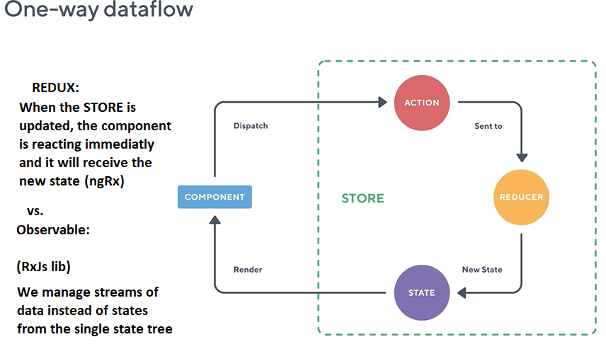
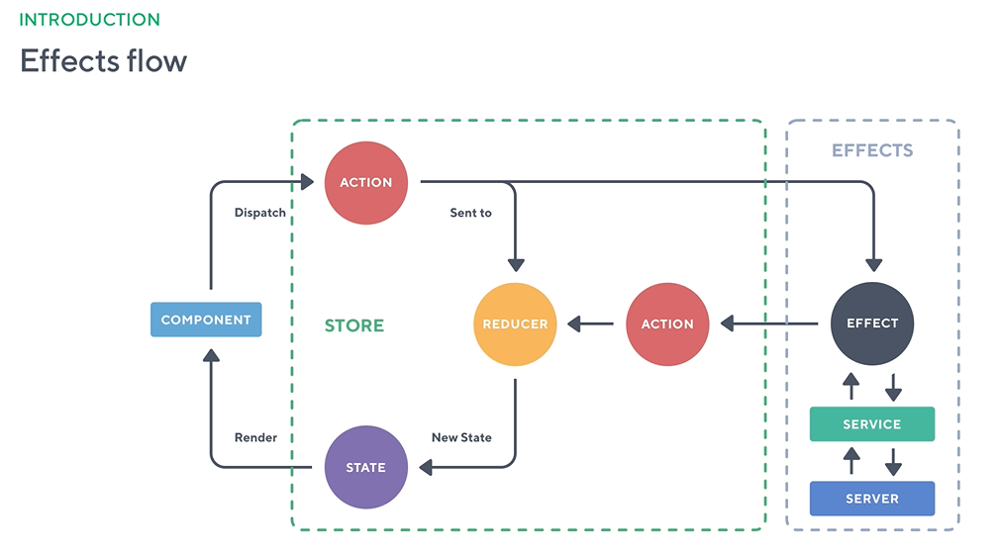
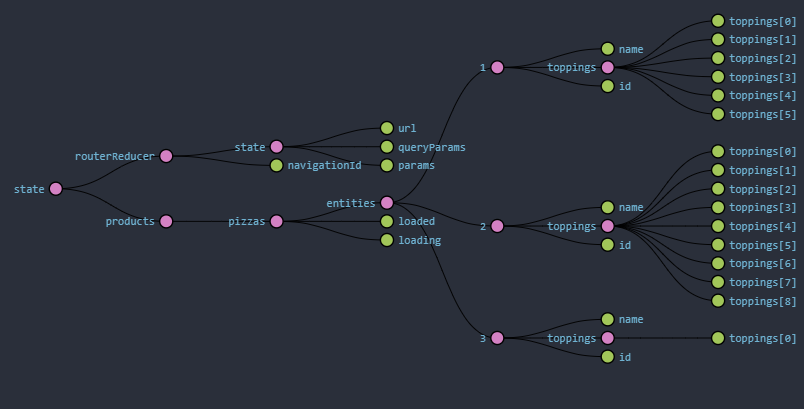

<!-- START doctoc generated TOC please keep comment here to allow auto update -->
<!-- DON'T EDIT THIS SECTION, INSTEAD RE-RUN doctoc TO UPDATE -->
**Table of Contents**  *generated with [DocToc](https://github.com/thlorenz/doctoc)*

- [NgRx Implementation](#ngrx-implementation)
  - [Why REACTIVE](#why-reactive)
  - [Implementation](#implementation)
    - [Step - add action constants and creators](#step---add-action-constants-and-creators)
    - [Step - create and register the reducer](#step---create-and-register-the-reducer)
    - [Step: composition with selectors](#step-composition-with-selectors)
    - [Side Effects Model for ngRx/store](#side-effects-model-for-ngrxstore)
    - [Optimize Data Structures with Entities](#optimize-data-structures-with-entities)
    - [Hooking up @ngRx-router-store](#hooking-up-ngrx-router-store)
    - [Extending the State Tree](#extending-the-state-tree)
    - [Entity Patterns, CRUD opperations](#entity-patterns-crud-opperations)
    - [Routing via Dispatch](#routing-via-dispatch)
    - [State Preload  and Protection via Guards](#state-preload--and-protection-via-guards)
    - [Observables and Change Detection](#observables-and-change-detection)
    - [Unit Testing](#unit-testing)

<!-- END doctoc generated TOC please keep comment here to allow auto update -->

# NgRx Implementation

For dev add Augury and Redux Chrome extensions.

## Why REACTIVE

{

 - WHY: scale insanely, reduce latency

 - Reactive example : Microsoft EXCEL, everything in IT, nowdays is reactive interaction.

 - Programming in reactive + functional style.

 - functional = (functional composition + lazy evaluation);

 - lazy evaluation == efficiency (avoiding things that shouldn't be done in the first place)

 - do not expose your datatabase(never share databases!), instead export your data

}

Understanding the OBSERVABLE PATTERN is the key for understanding RxJs Library and using the operators to programm in a reactive style.

Understanding the REDUX PATTERN is the key for understanding ngRx Library and using it to programm in a reactive style.

 - reactive programming = dataflow computing:
 
 a) using OBSERVABLE == STREAM OF DATA - from a big stream of data we extract that particular data to complete required data processing
  
 b) using REDUX == Single STATE TREE(a big Plain JavaScript Object) inside STORE - we use a REDUCER (Pure function) to update the STATE:

respond to acton types, returning a new state.

Both in a) and b) rective styles we use immutable update patterns: 



 - dispatch = deal with (a task or opponent) quickly and efficiently

we do not change the data stream from the input, but rather obtain a new data, and use it.

NgRx library allows to react to state change in an observable stream, we have an observable driven state management.

Understanding the REDUX PATTERN is the key for understanding ngRx Library and using it to programm in a reactive style.

 - manage state using the ngRx STORE

 - redux with observables = manage the state usesing observables streams of data

 - immutable @Inputs (modify the copies of objects, and create new objects using the reference of the initial object)

 - performance benefits because object reference checks are fast (use ChangeDetectionStrategy.OnPush to compare object references, not objects)

 - root and feature module support for: eagerly loaded modules & lazily loaded modules

 - if objects changed after a mutation, we ignore the ChangeDetectionStrategy and we use observables to push new changes down the component tree

## Implementation

``ng serve`` will start Angular app at port 4200

  - install @ngrx/effects lib to handle side effects

  - install @ngrx/store-devtools lib to inspect different states before changing a state

  - install on dev @ngrx/store-freeze lib for safety mesure to prevent to modify a state in the wrong way -  in a reducer for example, this package prevents

  us to modify the state - use it only on dev, appling to each reducer a metareducer, like this:

  ```TypeScript
  export const metaReducers: MetaReducer<any>[] = !environment.production
  ? [storeFreeze]
  : [];
  ```

We use db.json(! outside of /src/assets/ or /src/app/ folder -   to avoid Angular from keeping a watch on data file) as fake server to mock data so:

``npm install json-server --save-dev``

Start the app with proxy server:

``npm run start:proxy`` (see the package.json config)

The implementation using the json-server will use port 3000:

``npm run mock:server`` to start json server to watch after data changes inside db.json (see the package.json config)

Article about using json server with Angular 7 [here](https://medium.com/@kaustubhtalathi/mock-data-for-angular-5-applications-with-json-server-part-1-d377eced223b).

 ### Step - add action constants and creators

For type checking we create a customized type: 

`export type PizzasActions = LoadPizzas | LoadPizzasFail | LoadPizzasSuccess;`

Create a centralized store for products.  We need to dispach an action to display products. 

```TypeScript
export interface PizzaState {
    data: Pizza[];
    loaded: boolean;
    loading: boolean;
}

export const initialState: PizzaState = {
    data: [],
    loaded: false,
    loading: false
}

export function reducer(
    state = initialState,
    action: Pizzas.PizzasActions
): PizzaState {
    switch (action.type) {
        case Pizzas.LOAD_PIZZAS: {
            return {
                ...state,
                loading: true
            }
        }
        case Pizzas.LOAD_PIZZAS_FAIL: {
            return {
                ...state,
                loading: false,
                loaded:false
            }
        }
        case Pizzas.LOAD_PIZZAS_SUCCESS: {
            return {
                ...state,
                loading: false,
                loaded: true
            }
        }
    }
    return state;
}
```

### Step - create and register the reducer

For this dispach action we need a status( loading, failed, success)

Adding `StoreModule.forFeature('products', reducers)` to imports array of the products module will enable the lazy loading, binding the `reducers` from reducers folder.

### Step: composition with selectors

Refactor by setting the container component to accept the store and remove all curentlly used services.

In the reducer we export all the pizzas state.

```TypeScript

export interface ProductState {
    pizzas: pizzas.PizzaState
}

export const reducers: ActionReducerMap<ProductState> = {
    pizzas: pizzas.reducer
}

 export const getProductsState = createFeatureSelector<ProductState>('products');
```

Use  ActionReducerMap, createFeatureSelector, createSelector methods from '@ngrx/store'

Add the products structure in the apps state tree:

```TypeScript
const state = {
    products: {
        pizzas: {
            data: [],
            loaded: false,
            loading: false
        }
    }
}
```
First get the products from the state tree (and we add the ProductState as a generic type for the featureSelector):

```TypeScript
export const getProductsState = createFeatureSelector<ProductState>('products');
```
Create a generic selector:

```TypeScript
// ..

export const getPizzaState = createSelector(
    getProductsState,
    (state: ProductState) => state.pizzas
);
```

We make a selector for each different properties, at different levels, that we need from the state tree:

```TypeScript
export const getAllPizzas = createSelector(getPizzaState, pizzas.getPizzas);
export const getPizzasLoaded = createSelector(getPizzaState, pizzas.getPizzasLoaded);
export const getPizzasLoading = createSelector(getPizzaState, pizzas.getPizzasLoading);
```
 
So, selectors allow us to pass to a particular component, only that needed slice from the app state (lazy loading for optimization) 

### Side Effects Model for ngRx/store

- listen for ngrx/store actions

- isolate side effects from component

- communicate outside of Angular

EFFECT =  just a mechanism to fetch data from the STORE and put back in the STORE

Reducer and effect could be interested in the same data. Difference is  that the reducer is a pure function, is synchronous, but the EFFECT can return data from outside 

the Angular app. The EFFECT is an **observable stream**, and we will be passing the stream of data as a response to the reducer via a dispatch action:



### Optimize Data Structures with Entities

 - change the data[] array from the action.payload  and flatten it into  `entities` pure object:

 ```TypeScript
 const pizzas = action.payload;

    const entities = pizzas.reduce(
    (entities: { [id: number]: Pizza }, pizza: Pizza) => {
        return {
        ...entities,
        [pizza.id]: pizza,
        };
    },
    {
        ...state.entities,
    }
);
```
and obtain all pizzas entities using a selector to map the id of each entity and return a new array  containing the entities:

```TypeScript
    export const getAllPizzas = createSelector(
        getPizzasEntities, entities => {
        return Object.keys(entities).map(id => entities[parseInt(id, 10)]);
    });
```
### Hooking up @ngRx-router-store

Create a store in the main app.

In the reducer:

```TypeScript
export interface RouterStateUrl {
    url: string;
    queryParams: Params;
    params: Params;
}

export interface State {
    routerReducer: fromRouter.RouterReducerState<RouterStateUrl>
}
```
The router reducer is conforming to the format of RouterStateUrl object:

```TypeScript

export const reducers: ActionReducerMap<State> = {
    routerReducer: fromRouter.routerReducer
}
```

In app's module imports array, initialiaze app state tree:

```TypeScript
    StoreModule.forRoot(reducers, { metaReducers }),
```

    Destructure the url from routerState:

```TypeScript
    const { url } = routerState;
```


Add the ``StoreRouterConnectingModule`` to app module's imports array;

Add into the providers array the:

`{ provide: RouterStateSerializer, useClass: CustomSerializer }`

After bounding the routerState to the store, we do not need to inject router and ActivatedRouter into components constructors.

The async pipe will subscribe and unsubscribe from the  ``pizza$`` stream of data:

``pizza$ | async``

### Extending the State Tree

Set up a new set of actions for toppings, similar with the one for pizzas.

reducers should be in files named: feature.reducer.ts,

effects -> feature.effect.ts

actions -> feature.action.ts

Route Guards are necessar.

### Entity Patterns, CRUD opperations

- for each event create the required actions

```JavaScript
// remove pizzas

export const REMOVE_PIZZAS = '[Products] Remove Pizzas';
export const REMOVE_PIZZAS_FAIL = '[Products] Remove Pizzas Fail';
export const REMOVE_PIZZAS_SUCCESS = '[Products] Remove Pizzas Success';

export class RemovePizza implements Action {
  readonly type = REMOVE_PIZZAS;
  constructor(public payload: any) {}
}

export class RemovePizzaSuccess implements Action {
  readonly type = REMOVE_PIZZAS_SUCCESS;
  constructor(public payload: Pizza) {}
}

export class RemovePizzaFail implements Action {
  readonly type = REMOVE_PIZZAS_FAIL;
  constructor(public payload: any) {}
}
```

- for each action (e.g. a REMOVE event) add the corresponding  reducer:

```JavaScript

    case fromPizzas.REMOVE_PIZZAS: {
        const pizza = action.payload;
        //use destructuring assignment mark the removed pizza and change the entities of the app's state  
        const { [pizza.id]: removed, ...entities } = state.entities;
        // bind the new entities to the returned state
        return {
            ...state,
            entities
        };
    }
```

- for each event that has to propagate to the server ( e.g CREATE operation) add the corresponding effect by filtering the actions stream of data. 

 This filter will use only the the specified by type actions to get the payload of the action and will switch to a new stream of data, obtained after getting the response from  the data server .

Here,this filter will use only the `CREATE_PIZZAS` actions to get the payload of the action and will switch to a new stream of data, obtained `POSTING` to json-server via `createPizza` method :

```JavaScript
 @Effect()
  createPizza$ = this.actions$.pipe(
    ofType(pizzaActions.CREATE_PIZZAS),
    map((action: pizzaActions.CreatePizza) => action.payload),
    switchMap((pizza) => { 
      return this.pizzaService
        .createPizza(pizza)
        .pipe(
          map(pizza => new pizzaActions.CreatePizzaSuccess(pizza)),
          catchError(error => of(new pizzaActions.CreatePizzaFail(error))
          )
        
      )
    })
  );
```

- for each feature dispatch the corresponding action in the component's methods, for eaxample:
```JavaScript
  onRemove(event: Pizza) {
    const remove = window.confirm('Are you sure?');
    if (remove) {  
      this.store.dispatch(new fromStore.RemovePizza(event));

    }
  }
```

### Routing via Dispatch


### State Preload  and Protection via Guards

### Observables and Change Detection

### Unit Testing