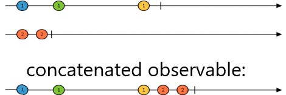
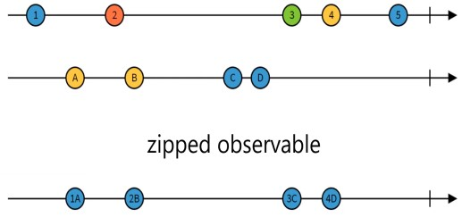

<!-- START doctoc generated TOC please keep comment here to allow auto update -->
<!-- DON'T EDIT THIS SECTION, INSTEAD RE-RUN doctoc TO UPDATE -->
**Table of Contents**  *generated with [DocToc](https://github.com/thlorenz/doctoc)*

- [Testing RxJS Operators](#testing-rxjs-operators)
  - [Concat](#concat)
  - [Zip](#zip)

<!-- END doctoc generated TOC please keep comment here to allow auto update -->

#  Testing RxJS Operators

## Concat 

- Concat - concats the next observable when previous completes
- Concat usage example: make 10 different api calls, all in sequence; before navigate to home page make sure all api calls are done
- for such requirement we concat observables and only after that we subscribe




```TypeScript
 it('should concat 2 observables', () => {
    const obs1$ = cold('---a---b|'); // the observables must complate in order order to be concatenated 
    const sub1 = '^-------!';
    const obs2$ = cold('---c---d|');
    const sub2 = '--------^-------!';
    const result$ = obs1$.pipe(concat(obs2$));

    const expected$ = cold('---a---b---c---d|');

    expect(result$).toBeObservable(expected$);
    expect(obs1$).toHaveSubscriptions(sub1);
    expect(obs2$).toHaveSubscriptions(sub2);
  });
```
Example: Pizza order event - each action has to complete before the following one is added to time line

```TypeScript
xit('serving pizza to customer', () => {
    const status = {
      orderCreated: '📦 order placed',
      paymentReceived: '💰 received',
      orderReady: '🍕 ready 😋',
      orderShipped: '🍕 shipped 🚀'
    };
    // order is created after 20ms and completes  after 50ms
    const $orderCreated = cold('--c--|', {
      c: status.orderCreated
    });
    // the receiving event takes place after 3 fames and completes after 40ms
    const $paymentReceived = cold('---p|', {
      p: status.paymentReceived
    });
    // the order is ready after 10ms and completes after 30ms
    const $orderReady = cold('-r-|', {
      r: status.orderReady
    });
    // order starts shipping after another 30ms and shiping completes after  a total of 60ms
    const $orderShipped = cold('---s--|', {
      s: status.orderShipped
    });
    const expected$ = cold('--f-----u-n----i--|', {
      f: status.orderCreated,
      u: status.paymentReceived,
      n: status.orderReady,
      i: status.orderShipped
    });
    const result$ = servePizza(
      $orderCreated,
      $paymentReceived,
      $orderReady,
      $orderShipped
    );
    expect(result$).toBeObservable(expected$);
  });
```

## Zip



- the resulting zipped observable contains paired values from both observables 
- the resulted Observable won't emit values unless there is a corresponding values in both observables
- the zip stream compleates when each stream compleates and values from streams have been picked up by the zipped stream

Example: Draw a line resolved with zip:

- take the mouse event by using both the x and y coordinates pointed by mouse movement until the mouse event stops, point in which both observables for x and y coordinates complete; 

```TypeScript
describe('zip', () => {
  it('can zip 2 streams', () => {
    const obs1$ = cold('---a---b---|', { a: 1, b: 3 });
    const obs2$ = cold('-----c---d---|', { c: 5, d: 7 }); // for val a from obs1 there is no value at frame 30 in obs2
    // at frame 50 the zipped observable will receive ac value
    // ---a---b---| // obs1
    // -----c---d---| // obs2
    // -----x---y-| // zipped where x contains both a and c values, and y contains both b and d values
    const result$ = obs1$.pipe(zip(obs2$, (x: number, y: number) => x + y));
    const expected$ = cold('-----x---y-|', {
      x: 1 + 5,
      y: 3 + 7
    });
    expect(result$).toBeObservable(expected$);
  });

  it('can create users from user properties', () => {
    const names$ = cold('-a-b-c-d-e-|', {
      a: 'John',
      b: 'Paul',
      c: 'Neel',
      d: 'Stacy',
      e: 'Carey' 
    });
    const userids$ = cold('-j-k-l-m-|', {
      j: 'john',
      k: 'paul',
      l: 'neel',
      m: 'stacy'
    });
    const result$ = createUsers(names$, userids$);
    const expected$ = cold('-p-q-r-s-|', {
      p: { name: 'John', userid: 'john' },
      q: { name: 'Paul', userid: 'paul' },
      r: { name: 'Neel', userid: 'neel' },
      s: { name: 'Stacy', userid: 'stacy' }
    });
    expect(result$).toBeObservable(expected$);
  });
});

```